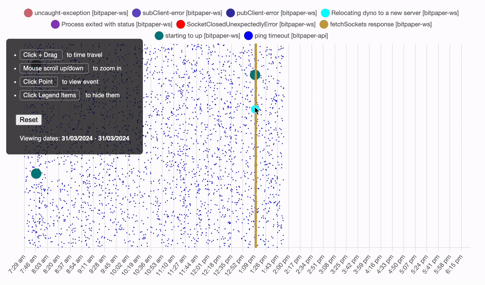

# Log Plotter

Visualise the frequency & timing of `console.logs` or exceptions
that happen across separate, distributed services logging using [Papertrail][pt]

- Doesn't need a database or a deployment.  
- It simply scours Papertrail logs for specific events/logs and plots their
  frequency on a navigable time plot.

We use it internally to debug pesky issues with no clear cause.

<p align="center">
  
</p>

> In the above image we traced mass WebSocket disconnections,
seen next to the cyan point, to a simple infrastructure platform rule that moves
the process to another server.

> This movement required more than 60 seconds which was more than our
`ping-timeouts`, hence the disconnections.

> The cyan point (representing a console.log of a server cycling message)
was zeroed-in as the culprit of the mass disconnections, as it was repeatedly &
reliably seen happening immediately before them.


## Install

Run:

```bash
$ git clone
$ npm install
```

## Declare log/events in config.yaml

Edit `config.yaml` to add the log message keywords you wish to visualise.   

Assuming you have 2 apps running on Heroku, with the Papertrail add-on attached:

- An app called **billing-app**, where you:
  - `console.log('redis-connect-error', err)`
  - `console.log('fetch-error', err)`
- Another app, called **invoicing app**, where you:
  - `console.log('GET /invoices timeout', err)`

You want to see when and how many times those `console.log` calls occured in
a time period.   

Declare those 2 apps, events you're interested in and how to plot them in
`config.yaml`:

```yaml
---
apps:
- name: billing-app
  token: <papertrail-app-token>
  events:
  - query: redis-connect-error
    size: 10
  - query: fetch-error
    size: 5
    color: teal
- name: invoicing-app
  token: <papertrail-app-token>
  events:
  - query: GET /invoices timeout
    size: 1
    color: blue
```

#### App parameters:

| Event | Type | Required? | Description |
|---|---|---|---|
| `app.name` | String | Required | Name of the Papertrail app that logs this log/event. |
| `app.token` | String | Required | Papertrail API token of this app |

> [!TIP]
> `app.token` will use an environmental variable if there's underscores in the
> token. i.e setting it to `INVOICING_APP_TOKEN` will use the environmental
> variable value of the same name

#### Event parameters:

| Event | Type | Required? | Description |
|---|---|---|---|
| `event.query` | String | Required | A subset of the string you `console.log()`.    If you log `console.log(redis-socket-error)`,  you can just declare `"socket-error"` here and it will still be picked up. |
| `event.color` | String:Hex color | Optional.  Defaults to random. | Use this color when painting the time plot point. |
| `event.size` | Number | Required | Use this radius for the time plot point. |

> [!TIP]
> `app.query` doesn't have to perfectly match the log itself, just a part of
> it is enough. i.e Setting it to `hello-w` will render logs that log
> `console.log('hello-world')`


### Run the visualiser

```bash
$ npm run start-dev
```  

and visit `localhost:3000`.

You should see those events plotted and you can navigate the graph.

## Todo

- [ ] Count objects in view
- [ ] Server tests
- [ ] UI tests

## Authors

- [@nicholaswmin](https://github.com/nicholaswmin)

[pt]: https://www.papertrail.com/
